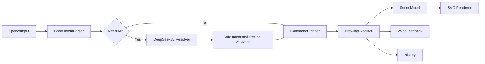

# 设计文档：Speak2Draw-Agent-Studio

## 项目目标

Speak2Draw-Agent-Studio 是一款纯语音控制的 AI 绘图工具。用户在应用内不依赖鼠标或键盘，通过语音完成绘图创作、对象选择、样式修改、位置调整、撤销重做、清空画布和导出作品。系统优先用本地规则处理明确指令；当本地规则无法理解时，使用 DeepSeek 进行自然语言理解、纠错澄清、复杂场景拆解和缺失元素的安全矢量配方生成，再由本地白名单绘图引擎执行。

## 架构计划

应用采用分层 Agent Studio 架构：

AI 不直接修改 DOM，也不执行任意代码。DeepSeek 只能返回结构化 JSON，应用会重新校验意图类型、图形类型、颜色、位置、尺寸、选择器和配方数量，校验通过后才进入绘图执行器。

## 计划支持的指令能力

| 能力 | 示例 | 目标 |
| --- | --- | --- |
| 创建图形 | 画一个红色圆形 | 支持圆形、矩形、椭圆、线条、三角形、文字 |
| 命名对象 | 画一个蓝色圆形叫月亮 | 支持创建时命名，并在后续指令中按名称选择和编辑 |
| 选择对象 | 选择最后一个图形 | 支持最后对象、颜色、形状和对象名称匹配 |
| 修改样式 | 把它改成黄色 | 支持填充色、描边色和线宽调整 |
| 移动对象 | 向右移动一点 | 支持方向移动和位置移动 |
| 缩放对象 | 放大一点 | 支持放大、缩小 |
| 图层顺序 | 把房子放到最上层 | 支持置顶、置底、前移一层、后移一层 |
| 历史操作 | 撤销、重做 | 支持多步撤销重做 |
| 画布操作 | 清空画布 | 支持清空和导出 |
| 复杂指令 | 画一个房子和太阳 | 拆解为多个基础绘图命令 |
| 普通组合图形 | 画一个蓝色圆形和绿色矩形 | 按连接词拆分多个基础图形，并保留各自颜色 |
| 复合长句 | 画一个红色房子和蓝色太阳，再把房子放到最上层 | 支持创建、编辑、图层等动作按顺序排队执行 |
| 语音查询 | 画布里有什么、当前选中的是什么 | 不修改画布，仅反馈能力说明、画布状态和当前选中对象 |
| AI 自然语言理解 | 月亮换个梦幻感 | 本地规则不确定时由 DeepSeek 转换为安全绘图意图 |
| AI 缺失元素生成 | 画一只戴帽子的猫 | 将没有内置图形的对象拆成多个安全 SVG 矢量对象 |
| AI 澄清 | 画一个神秘角色 → 戴红帽子的猫 | 不确定时返回澄清原因，并允许用户用下一句语音补充 |
| 容错澄清 | 这句没听清 | 低置信度或无目标对象时要求澄清 |

## 最终实现情况

| 能力 | 状态 | 说明 |
| --- | --- | --- |
| 创建图形 | 已实现 | 支持圆形、矩形、椭圆、线条、三角形、文字 |
| 命名对象 | 已实现 | 支持“叫、命名为、名字叫、名称叫”等命名表达，后续可按名称选择和编辑 |
| 选择对象 | 已实现 | 支持最后对象、颜色、形状和对象名称匹配 |
| 修改样式 | 已实现 | 支持颜色、填充、描边、线宽 |
| 移动对象 | 已实现 | 支持方向移动和目标位置 |
| 缩放对象 | 已实现 | 支持放大和缩小 |
| 图层顺序 | 已实现 | 支持置顶、置底、前移一层、后移一层，并保持 SVG 导出顺序一致 |
| 历史操作 | 已实现 | 支持撤销和重做；多步复杂语音命令按一条历史事务回退 |
| 画布操作 | 已实现 | 支持清空和 SVG 导出 |
| 复杂指令拆解 | 已实现 | 支持房子、太阳、树、机器人等组合 |
| 普通组合图形 | 已实现 | 支持“蓝色圆形和绿色矩形”等基础形状组合，按片段识别形状和颜色 |
| 复合长句执行 | 已实现 | 支持把一整句中的创建和后续操作拆成命令队列，并用临时场景规划后续步骤 |
| 语音查询反馈 | 已实现 | 支持“我能说什么”“画布里有什么”“当前选中的是什么”等只读查询 |
| AI 自然语言理解 | 已实现 | 本地规则未知或需要澄清时，请求 `/api/ai/intent`，由 DeepSeek 输出安全意图 |
| AI 缺失元素生成 | 已实现基础版 | DeepSeek 可返回 `create_asset_recipe`，用圆形、矩形、三角形、线条和文字等白名单对象拼出猫、船、云等缺失元素 |
| AI 多轮澄清 | 已实现 | AI 可返回 `unknown` 或 `clarify`；应用会记录上一轮原话和澄清问题，下一句语音会携带上下文继续请求 DeepSeek |
| AI 状态诊断 | 已实现 | 页面展示本地规则、DeepSeek 解析成功、请求中和回退原因，便于确认 AI 是否实际参与 |
| 响应延迟记录 | 已实现 | 每次执行记录毫秒级耗时 |
| 完全离线语音识别 | 未完成 | 浏览器 Web Speech API 依赖运行环境支持 |

## 容错策略

- 语音置信度低于阈值时，不直接执行绘图操作，而是语音提示用户重新表达。
- 指令需要选中对象但当前没有对象时，返回澄清提示。
- 无法识别的指令不会修改画布，只记录为待澄清状态。
- 本地规则无法理解时才调用 AI 兜底，避免所有简单指令都等待网络响应。
- DeepSeek API Key 只从 `.env.local` 读取，由 Vite 本地代理持有，浏览器端代码不包含密钥。
- AI 返回结果必须经过安全校验；非法图形、非法颜色、过大尺寸、嵌套 sequence 和无法解析的 JSON 会被拒绝。
- AI 素材配方最多执行 16 个对象，且只能使用白名单基础图形，避免任意 SVG、脚本或 HTML 注入。
- 页面会显示 AI 解析状态和回退原因；未配置 DeepSeek、网络超时或返回不安全内容时，用户能看到明确原因，画布不会被不确定结果修改。
- 需要澄清时，应用保存上一轮原始语音和澄清问题；用户下一句补充会自动合并上下文交给 DeepSeek，不需要鼠标或键盘选择上下文。
- 样式修改必须包含明确颜色、描边或粗细信息，例如“把它改成漂亮一点”不会被误报为成功更新。
- 复杂指令由 CommandPlanner 拆解为多个基础命令，执行时按顺序应用到场景模型。
- 复合长句会先拆成多个意图，再在规划阶段用临时场景逐步推演，避免“后半句引用刚创建对象”时找不到目标。
- 帮助和状态查询属于只读语音意图，不写入画布历史，也不会被当成失败指令。
- 多步语音命令执行时按一次历史事务写入；用户说“撤销”会回退整条语音指令，而不是只撤销最后一个底层绘图步骤。

## 指令理解策略

指令解析前先进行中文语音文本归一化：

- 清理标点、空白和语音识别常见停顿符。
- 修正常见图形词偏差，例如“圆型”归一为“圆形”、“矩型”归一为“矩形”。
- 在复杂绘图语境中修正常见同音误识别，例如“名字和太阳”按“房子和太阳”处理。
- 明确文字输入场景不做激进修正，例如“写名字”仍按文字内容“名字”执行。
- 创建图形时支持对象命名，例如“画一个蓝色圆形叫月亮”；后续“选择月亮”“把月亮改成红色”“把月亮向右移动一点”会按名称匹配。
- 编辑、移动、缩放和删除指令会优先识别明确目标名称，例如“把太阳改成红色”“删除太阳”。
- 基础形状组合会按“和、还有、同时、一起、加上”等连接词拆分片段，例如“画一个蓝色圆形和绿色矩形”会创建蓝色圆形和绿色矩形。
- 遇到“然后、接着、随后、并且、再把”等连接词时，会尝试把长句拆成顺序意图，例如先创建房子和太阳，再把房子放到最上层。
- 支持通过语音询问能力和状态，例如“我能说什么”“画布里有什么”“当前选中的是什么”，让用户不依赖鼠标或键盘确认工作台状态。
- 当用户表达“月亮换个梦幻感”“画一只戴帽子的猫”等本地规则难以覆盖的自然语言时，AI Resolver 会请求 DeepSeek，把语音文本、当前画布对象名称、对象类型、颜色和选中对象一起发送给模型，由模型返回结构化意图或矢量配方。
- 当系统显示“等待补充”时，下一句语音会携带 `clarificationContext`，其中包含上一轮原话、澄清问题和原因，DeepSeek 需要把两轮内容合并理解。

归一化只处理高频、可解释、可测试的误识别。任意自然语言理解由 AI 兜底承担，但 AI 结果必须回到同一套安全执行链路。新增词表或 AI 输出格式必须配套解析、规划或端到端回归测试。

## AI 集成策略

- AI Intent Resolver：把自然语言语音文本转换为 `DrawingIntent`，例如把“月亮换个梦幻感”转换为按名称修改对象样式。
- AI Scene Planner：允许返回 `sequence`，把“画一个海边日落，有小船和飞鸟”拆成多个创建、移动、样式或图层意图。
- AI Asset Recipe Generator：允许返回 `create_asset_recipe`，把猫、船、云、人物等没有内置模板的对象拆成多个安全基础图形。
- Safe Validator：校验 AI 返回内容，只允许白名单类型、白名单图形、十六进制颜色、受限尺寸和有限数量。
- Local Fallback：当 DeepSeek 未配置、超时或返回内容不安全时，应用保留本地规则的澄清反馈，不执行不确定内容。
- AI Diagnostics：记录每条语音是否由本地规则处理、是否请求 DeepSeek、DeepSeek 解析出的意图类型，以及失败或回退原因。
- Clarification Context：保存上一轮未完成请求，下一句语音自动作为补充提交给 AI；执行成功后清空上下文。

## 语音端点策略

语音输入层拆分为三个职责：

- SpeechProvider：负责创建和配置浏览器 Web Speech API，默认使用 `zh-CN`、非连续单轮识别和中间结果。
- EndpointPolicy：集中管理无语音超时、停顿等待、中间结果稳定等待、最终结果兜底超时和自动重启延迟。
- TranscriptAssembler：汇聚中间识别结果和最终识别结果，保证同一轮语音只提交一次，并在浏览器迟迟不返回最终结果时使用最新中间结果兜底。
- RecognitionSnapshot：把浏览器返回的一组识别片段合并为整轮快照；只要仍有中间片段，就继续等待补充，避免长句被前半句提前执行。

当前默认策略偏向“等用户说完”：检测到语音停顿后不会立即执行，而是保留短暂宽限期；如果浏览器只持续返回中间结果，则等待稳定窗口后再兜底提交。后续可以按场景切换快速、均衡、耐心三档策略。

## 响应延迟目标

- 简单指令：识别完成后到画布更新尽量小于 300ms。
- 复杂指令：允许多步执行，但需要给出明确语音反馈。
- 应用在每次命令执行后显示最近一次延迟，便于手工 QA。

## 平台限制

浏览器麦克风授权需要用户与浏览器权限弹窗交互，这是 Web 平台限制。授权完成后，应用内创作流程不要求鼠标或键盘。

## 测试方式

- 单元测试覆盖语音指令解析、复杂指令拆解和场景模型操作。
- 单元测试覆盖 DeepSeek 请求摘要、AI 意图校验、AI 素材配方清洗和 AI 客户端失败回退。
- 集成测试通过模拟 transcript 验证从语音文本到画布对象变化的完整链路。
- Playwright 端到端测试通过 `?e2e=1` 测试入口模拟浏览器语音识别返回文本，并 mock `/api/ai/intent`，验证真实页面中的画布更新、AI 兜底解析、AI 多轮澄清、AI 回退诊断、目标编辑和移动端布局。
- 手工 QA 以“不使用鼠标键盘完成一次绘图”为验收场景。

## 未完成部分原因

- 未接入真实图片生成模型：当前 DeepSeek 接入用于文本理解和安全矢量配方生成，不直接生成 PNG/JPEG 素材；后续可接入图片生成服务并作为可编辑素材插入画布。
- 未实现服务端生产部署：当前 AI 代理运行在 Vite 开发服务中，适合本地演示和测试；生产环境需要独立后端或托管函数保护密钥。
- 未实现移动端专项适配：当前阶段优先保证桌面浏览器可运行。
- 未实现完全自由笔刷绘画：第一版优先保证语音可控、结构化、可测试、可解释的矢量绘图。
