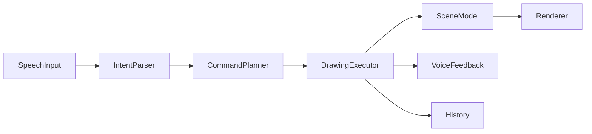

# 设计文档：Speak2Draw-Agent-Studio

## 项目目标

Speak2Draw-Agent-Studio 是一款纯语音控制的绘图工具。用户在应用内不依赖鼠标或键盘，通过语音完成绘图创作、对象选择、样式修改、位置调整、撤销重做、清空画布和导出作品。

## 架构计划

应用采用分层 Agent Studio 架构：

## 计划支持的指令能力

| 能力 | 示例 | 目标 |
| --- | --- | --- |
| 创建图形 | 画一个红色圆形 | 支持圆形、矩形、椭圆、线条、三角形、文字 |
| 选择对象 | 选择最后一个图形 | 支持最后对象、颜色和形状匹配 |
| 修改样式 | 把它改成黄色 | 支持填充色、描边色和线宽调整 |
| 移动对象 | 向右移动一点 | 支持方向移动和位置移动 |
| 缩放对象 | 放大一点 | 支持放大、缩小 |
| 历史操作 | 撤销、重做 | 支持多步撤销重做 |
| 画布操作 | 清空画布 | 支持清空和导出 |
| 复杂指令 | 画一个房子和太阳 | 拆解为多个基础绘图命令 |
| 容错澄清 | 这句没听清 | 低置信度或无目标对象时要求澄清 |

## 最终实现情况

| 能力 | 状态 | 说明 |
| --- | --- | --- |
| 创建图形 | 已实现 | 支持圆形、矩形、椭圆、线条、三角形、文字 |
| 选择对象 | 已实现 | 支持最后对象、颜色和形状匹配 |
| 修改样式 | 已实现 | 支持颜色、填充、描边、线宽 |
| 移动对象 | 已实现 | 支持方向移动和目标位置 |
| 缩放对象 | 已实现 | 支持放大和缩小 |
| 历史操作 | 已实现 | 支持撤销和重做 |
| 画布操作 | 已实现 | 支持清空和 SVG 导出 |
| 复杂指令拆解 | 已实现 | 支持房子、太阳、树、机器人等组合 |
| 响应延迟记录 | 已实现 | 每次执行记录毫秒级耗时 |
| 完全离线语音识别 | 未完成 | 浏览器 Web Speech API 依赖运行环境支持 |

## 容错策略

- 语音置信度低于阈值时，不直接执行绘图操作，而是语音提示用户重新表达。
- 指令需要选中对象但当前没有对象时，返回澄清提示。
- 无法识别的指令不会修改画布，只记录为待澄清状态。
- 复杂指令由 CommandPlanner 拆解为多个基础命令，执行时按顺序应用到场景模型。

## 语音端点策略

语音输入层拆分为三个职责：

- SpeechProvider：负责创建和配置浏览器 Web Speech API，默认使用 `zh-CN`、非连续单轮识别和中间结果。
- EndpointPolicy：集中管理无语音超时、停顿等待、中间结果稳定等待、最终结果兜底超时和自动重启延迟。
- TranscriptAssembler：汇聚中间识别结果和最终识别结果，保证同一轮语音只提交一次，并在浏览器迟迟不返回最终结果时使用最新中间结果兜底。

当前默认策略偏向“等用户说完”：检测到语音停顿后不会立即执行，而是保留短暂宽限期；如果浏览器只持续返回中间结果，则等待稳定窗口后再兜底提交。后续可以按场景切换快速、均衡、耐心三档策略。

## 响应延迟目标

- 简单指令：识别完成后到画布更新尽量小于 300ms。
- 复杂指令：允许多步执行，但需要给出明确语音反馈。
- 应用在每次命令执行后显示最近一次延迟，便于手工 QA。

## 平台限制

浏览器麦克风授权需要用户与浏览器权限弹窗交互，这是 Web 平台限制。授权完成后，应用内创作流程不要求鼠标或键盘。

## 测试方式

- 单元测试覆盖语音指令解析、复杂指令拆解和场景模型操作。
- 集成测试通过模拟 transcript 验证从语音文本到画布对象变化的完整链路。
- 手工 QA 以“不使用鼠标键盘完成一次绘图”为验收场景。

## 未完成部分原因

- 未接入云端大模型：为避免密钥和 token 风险，第一版仅使用本地规则解析。
- 未实现移动端专项适配：当前阶段优先保证桌面浏览器可运行。
- 未实现完全自由绘画：第一版优先保证有限指令稳定、可测试、可解释。
