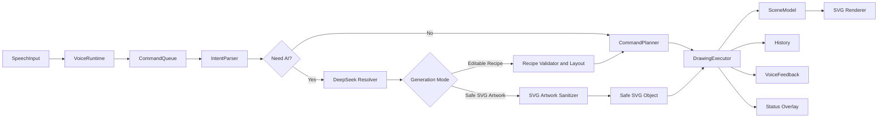

# 设计文档：Speak2Draw-Agent-Studio

## 项目目标

Speak2Draw-Agent-Studio 是一款纯语音控制的 AI 绘图工具。项目目标是让用户在创作阶段尽量不依赖鼠标或键盘，只通过中文语音完成绘图、选择、局部修改、撤销重做、状态查询、设置控制和 SVG 导出。

项目重点关注四件事：

- 指令理解准确性：把用户原话转换成可执行绘图意图。
- 语音交互稳定性：避免半句话误执行、回声误触发、低置信度危险操作误执行。
- 复杂指令拆解：把“画一个房子和太阳”“画一只戴帽子的狗”等请求拆成对象、部件和命令。
- AI 安全边界：DeepSeek 只返回受控 JSON 或可清洗 SVG，不能直接执行代码或修改 DOM。

## 总体架构

当前应用采用浏览器端优先的分层结构：



关键原则：

- AI 不直接修改 DOM，不执行脚本，不返回可直接信任的任意内容。
- 本地规则能处理的明确指令优先本地执行，降低响应延迟。
- 本地规则无法安全理解时，才请求 DeepSeek。
- AI 返回后必须经过 schema 校验、字段白名单、SVG 安全清洗或本地布局引擎处理。
- 多步语音命令按一次历史事务写入，撤销时回退整条语音指令。

## 计划支持的指令能力

| 能力 | 示例 | 计划目标 |
| --- | --- | --- |
| 基础图形创建 | 画一个红色圆形 | 支持圆形、矩形、椭圆、线条、三角形、文字 |
| 对象命名 | 画一个蓝色圆形叫月亮 | 支持创建时命名，并能按名称选择和编辑 |
| 对象选择 | 选择最后一个图形、选择房子的窗户 | 支持最后对象、名称、形状、颜色、素材组和局部部件 |
| 样式修改 | 把它改成黄色、把窗户改成蓝色 | 支持填充色、描边色和线宽 |
| 位置与大小 | 向右移动一点、放大一点 | 支持方向移动、位置移动、放大和缩小 |
| 图层顺序 | 把房子放到最上层 | 支持置顶、置底、前移、后移 |
| 历史操作 | 撤销、重做 | 支持多步撤销重做 |
| 画布操作 | 清空画布、导出 SVG | 支持清空和矢量导出 |
| 复杂对象 | 画一个房子和太阳 | 拆解为多个可执行绘图步骤 |
| 复合长句 | 画一个红色房子和蓝色太阳，再把房子放到最上层 | 支持按顺序拆解创建、编辑和图层操作 |
| 命名、改名、复制 | 把月亮改名为星星、复制星星 | 支持对象生命周期管理 |
| 文字编辑 | 把文字改成世界 | 支持修改文字对象内容 |
| 画布组织 | 把月亮和太阳成组叫夜空 | 支持成组、取消成组、对齐和分布 |
| 查询反馈 | 我能说什么、画布里有什么 | 支持只读查询，不修改画布 |
| 设置控制 | 打开设置、测试 AI 连接 | 支持语音打开设置、切换模型、切换生图模式和测试连接 |
| 状态控制 | 打开状态信息 | 支持语音打开状态浮层，查看语音、AI、SVG 清洗和工作流状态 |
| AI 自然语言理解 | 月亮换个梦幻感 | 本地不确定时由 DeepSeek 转换为安全绘图意图 |
| AI 可编辑配方 | 画一只戴帽子的猫 | AI 输出语义化配方，本地布局为可编辑素材组 |
| AI SVG 插画 | 画一只戴帽子的狗 | AI 输出完整 SVG，本地安全清洗后进入画布 |
| 局部编辑 | 把帽子删掉、把房子窗户改成蓝色 | 支持素材组和局部部件两种粒度 |
| 澄清和确认 | 这句没听清、确认删除吗 | 低置信度和危险操作必须澄清或确认 |

## 最终实现情况

| 能力 | 状态 | 说明 |
| --- | --- | --- |
| 基础图形创建 | 已实现 | 支持圆形、矩形、椭圆、线条、三角形和文字 |
| 对象命名、改名、复制 | 已实现 | 支持创建时命名、后续改名和复制单个对象或素材组 |
| 文字编辑 | 已实现 | 支持直接修改文字对象内容 |
| 对象选择 | 已实现 | 支持最后对象、名称、形状、颜色、整组和局部部件选择 |
| 样式修改 | 已实现 | 支持填充色、描边色和线宽调整 |
| 移动和缩放 | 已实现 | 支持方向移动、目标位置、放大和缩小 |
| 图层顺序 | 已实现 | 支持置顶、置底、前移和后移，导出顺序与场景一致 |
| 撤销重做 | 已实现 | 多步复杂语音命令按一次历史事务回退 |
| 清空和导出 | 已实现 | 支持清空画布和导出安全 SVG |
| 复杂指令拆解 | 已实现 | 支持房子、太阳、树、机器人、普通多图形组合和部分复合长句 |
| 成组、取消成组、对齐、分布 | 已实现 | 支持多对象组织和基础布局操作 |
| 语音查询 | 已实现 | 支持能力说明、画布对象、当前选中对象查询 |
| 设置语音控制 | 已实现 | 支持语音打开/关闭设置、切换模型、切换端点策略、测试 AI 连接和切换生图模式 |
| 状态信息语音控制 | 已实现 | 支持打开/关闭状态浮层，展示工作流、语音运行时、AI 状态和 SVG 清洗信息 |
| 语音运行时状态机 | 已实现 | 覆盖请求权限、启动、监听、捕获、沉淀、提交、处理、朗读、重启和错误状态 |
| 语音命令队列 | 已实现 | AI 慢请求期间后续语音入队，按顺序执行，不覆盖旧画布状态 |
| 语音反馈防回灌 | 已实现 | 系统朗读期间暂停或过滤相似识别结果，避免反馈被当成用户指令 |
| 危险操作确认 | 已实现 | 中间识别或低置信度的删除、清空、撤销等危险操作需要确认 |
| AI 可编辑配方模式 | 已实现 | 默认模式；DeepSeek 输出 `schemaVersion: "2.0"` 或兼容旧配方，本地布局为可编辑部件 |
| AI SVG 插画模式 | 已实现基础版 | 可切换模式；DeepSeek 输出 `svg-artwork-1.0`，本地清洗后作为安全 SVG 插画对象渲染 |
| SVG 安全清洗 | 已实现 | 禁止脚本、外链、事件属性、危险标签和过大内容，只保留白名单 SVG 元素与属性 |
| SVG 插画导出 | 已实现 | 导出清洗后的安全 SVG 内容，不导出原始 AI 响应 |
| 局部删除和局部改色 | 已实现基础版 | 配方模式较稳定；SVG 插画模式依赖 AI 返回的 parts manifest |
| AI 连接和配置 | 已实现 | 支持 DeepSeek base URL、模型、超时、会话 key、环境变量和连接测试 |
| 响应延迟记录 | 已实现 | 执行结果和状态面板展示耗时与 AI 阶段 |
| 自动化测试 | 已实现 | 单元、构建和 Playwright 端到端覆盖主要语音、AI、SVG、设置和布局链路 |

## AI 生图模式设计

### 可编辑配方模式

默认使用可编辑配方模式。该模式让 AI 输出语义化 JSON，系统负责本地排版和执行。

适合场景：

- 需要稳定局部编辑。
- 需要撤销、重做和组编辑。
- 需要把复杂对象拆成可测试的基础部件。

核心做法：

- 输入包含用户原话、当前场景对象、素材组、局部部件、选中状态和澄清上下文。
- AI 返回 `create_asset_recipe`、`revise_asset_part` 或其他白名单 intent。
- 本地校验 shape、color、slot、relativeTo、size、selector 等字段。
- 本地布局引擎把语义配方转换为真实 SVG 坐标。

### 安全 SVG 插画模式

安全 SVG 插画模式用于提升展示质量。该模式把用户原话和固定 SVG 生成要求一起发送给 AI，要求返回：

```json
{
  "schemaVersion": "svg-artwork-1.0",
  "name": "戴帽子的狗",
  "viewBox": "0 0 960 600",
  "svg": "<svg viewBox=\"0 0 960 600\">...</svg>",
  "parts": [
    { "id": "dog-hat-brim", "partName": "帽檐", "role": "accessory", "editable": true }
  ],
  "qualityNotes": "中心构图，贴纸风格，主体清晰。"
}
```

安全策略：

- 原始 SVG 永远不直接渲染。
- 禁止 `script`、`foreignObject`、`iframe`、`audio`、`video`、`image`、`use`、事件属性和外链 URL。
- 限制元素数量、字符数、path 长度和 viewBox 范围。
- 只允许白名单 SVG 标签和安全属性。
- 清洗失败时不修改画布，并给出明确状态反馈。

## 容错与安全策略

- 低置信度语音不会直接执行高风险操作。
- 删除、清空、撤销、重做、局部替换等危险动作在不稳定来源下要求语音确认。
- AI 请求期间继续接收语音，但新命令进入队列等待处理。
- AI 返回时校验命令 ID 和场景版本，避免旧响应覆盖新画布。
- 澄清上下文有取消词和独立新命令判断，用户可以说“取消”“重新开始”脱离上一轮澄清。
- 设置页会话 key 只存在当前标签页内存，不写入 localStorage、状态面板、执行记录或文档。
- `.env`、token、密钥和账号密码不提交到仓库。
- 生产推荐由 Netlify Function 持有 DeepSeek API Key，浏览器只调用同源 `/api/ai/intent`。

## 未完成部分与原因说明

### 1. 语音识别成熟能力尚未完全落地

在语音识别与语音交互方面，我学习了不少开源项目和成熟产品的处理方式，包括端点检测、连续语音分段、低置信度确认、语音反馈防回灌、多轮语音队列等机制。当前项目已经应用了其中一部分，例如语音状态管理、端点策略、低置信度澄清、危险操作确认、AI 处理状态提示和语音反馈防回灌。

但由于时间有限，仍有一些更深入的能力没有完全落地，例如更精细的自适应端点检测、跨浏览器真实麦克风表现统计、长期连续对话中的语音上下文管理，以及更完善的真实环境噪声处理。后续会继续把这部分学习成果逐步补充到项目中。

### 2. SVG 插画模式的局部编辑仍有短板

当前项目已经实现了安全 SVG 插画模式，AI 可以生成完整 SVG，并由本地进行安全清洗后渲染到画布中。但 SVG 插画模式下的局部编辑仍然存在短板：系统能否准确删除帽子、修改眼睛、替换窗户，比较依赖 AI 返回的 parts 标注是否清晰。

如果 AI 没有把局部结构标注好，系统很难像专业矢量编辑器一样理解每一条 path 的语义。因此当前版本对 SVG 插画的局部编辑属于基础支持，后续还需要继续增强 SVG 语义标注、局部边界计算和局部重绘能力。

### 3. 后端低延迟架构、真实图片生成模型与 AI 生图 API 能力尚未完整落地

项目早期曾经构思过后端工作流架构，希望通过后端任务编排、多智能体并行、确认拆分机制和异步任务管理，提高复杂指令理解与生成质量。同时也考虑过接入真正的 AI 生图 API，例如通过图像生成模型生成 PNG/JPEG 或更高质量的视觉素材，让系统不仅能生成 SVG，也能生成更接近真实插画效果的图片内容。

但在实际 demo 和响应时间测试之后，这条路线会显著增加系统延迟、接口复杂度和安全处理成本。语音交互对响应节奏非常敏感，如果用户每说一句话都需要等待较长时间，体验会明显下降。同时，图片生成结果相比 SVG 更难进行局部编辑、结构化修改和安全校验。

因此当前版本没有继续推进完整后端工作流、真实图片生成模型和 AI 生图 API 能力，而是先聚焦在浏览器端语音交互、DeepSeek 结构化理解、安全 SVG 生成和可编辑画布上。后续如果继续迭代，会重新设计后端架构，把任务拆分、异步生成、进度反馈、结果缓存、图片安全审核和 AI 生图 API 接入结合起来。

## 测试与验收

自动化测试覆盖：

- 语音状态机、端点策略、识别快照、错误恢复和反馈防回灌。
- 指令解析、复杂长句、对象命名、改名、复制、文字编辑、成组、对齐、分布。
- DeepSeek 请求 payload、AI JSON 契约、可编辑配方、SVG 插画合同和代理失败。
- SVG 安全清洗、SVG 插画对象创建、局部 manifest、撤销重做和导出。
- 设置页、状态浮层、画布布局、移动端核心面板和独立滚动。

本地回归命令：

```bash
npm test -- --run
npm run build
npm run test:e2e
```

手工演示建议路径：

1. `画一只戴帽子的狗`
2. `打开状态信息`
3. `把帽子删掉`
4. `撤销`
5. `画一个房子和太阳`
6. `选择房子的窗户`
7. `把窗户改成蓝色`
8. `导出 SVG`
